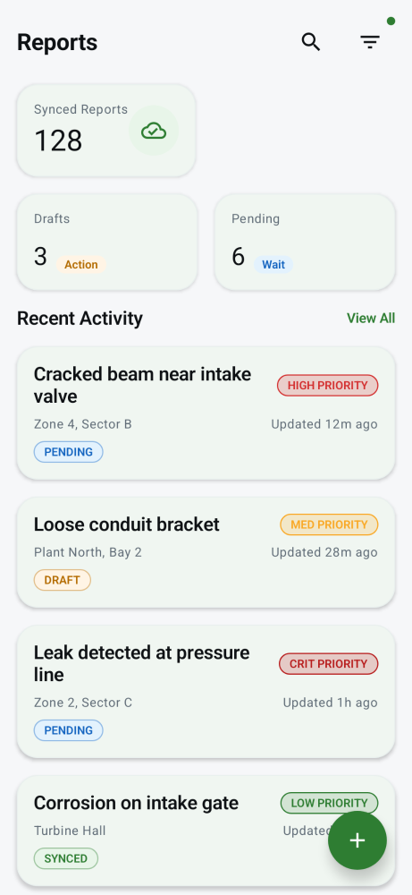
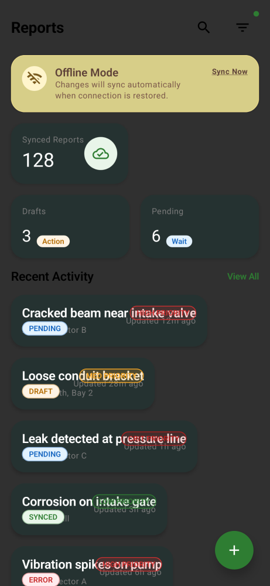
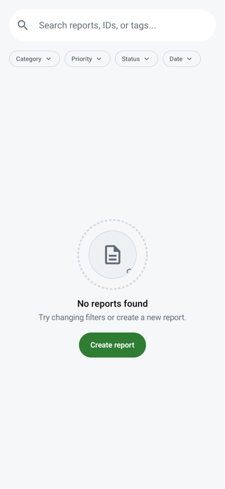
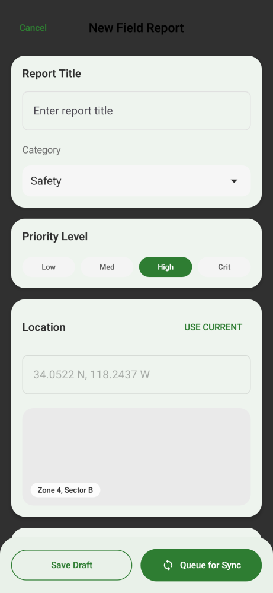
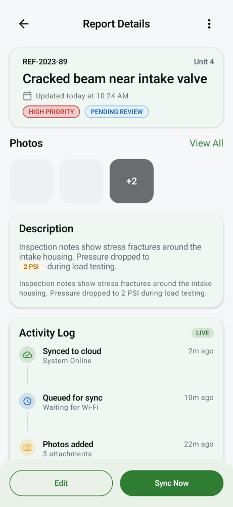
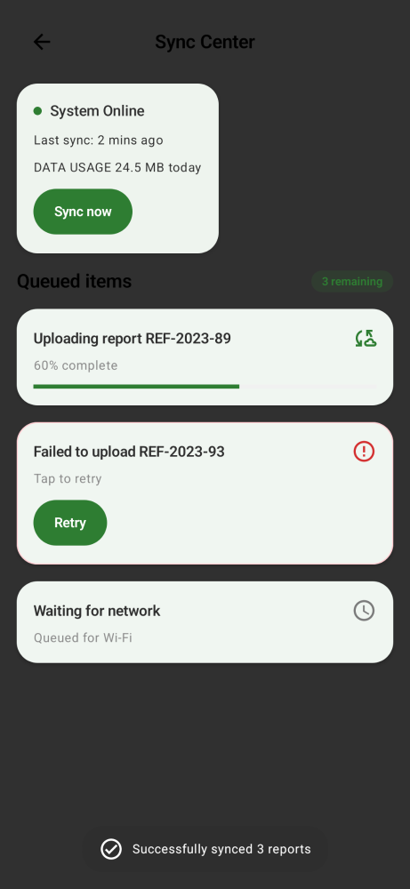
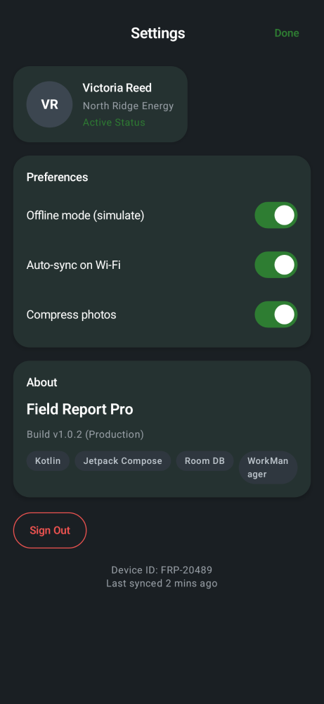

# Field Report Pro


Offline-first field incident reporting app for Android.

## Key Features

- Offline-first storage with Room (reports, attachments, timeline)
- Settings persistence via DataStore
- WorkManager sync queue with progress
- Photo attachments (gallery/camera) up to 3 per report
- Photo annotation (circle/arrow/rect) saving annotated PNG
- Deterministic screenshot pipeline with Paparazzi

## Screenshots

| Home (Light) | Home (Dark) | Empty State |
| --- | --- | --- |
|  |  |  |

| New Report | Report Detail | Sync Center |
| --- | --- | --- |
|  |  |  |

| Settings (Dark) | Annotation (Dark) |
| --- | --- |
|  |  |

## Architecture

- MVVM + Repository
- Room + DataStore + WorkManager
- See `docs/ARCHITECTURE.md`

## Run locally (Windows)

1) Configure the Android SDK:

```
./scripts/setup-android-sdk.ps1
```

2) Build:

```
./gradlew assembleDebug
```

## Generate screenshots

```
./scripts/record-screenshots.ps1
```

## Tests

```
./gradlew testDebugUnitTest
./gradlew verifyPaparazziDebug
./scripts/test-ci.ps1
```

## Troubleshooting

See `docs/TROUBLESHOOTING.md`. Build outputs are stored in `%USERPROFILE%\.fieldreportpro-build`.

## Roadmap

- Multi-select attachment management
- Sync scheduling policies
- Export/share report summary
